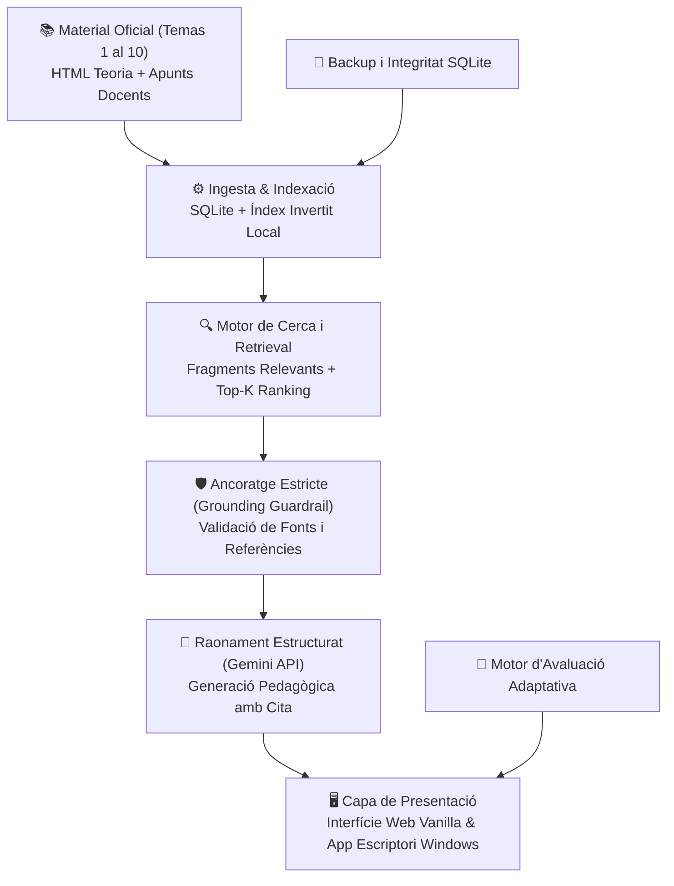

# 📡 Sistemes de Mesura · Tutor Acadèmic Verificable

[](https://www.python.org/downloads/)
[]()
[](LICENSE)
[]()
[]()
[-0071e3.svg)]()

> **Tutor intel·ligent, verificable i entorn d'estudi local** anclat al material docent oficial de l'assignatura **Sistemes de Mesura (ETSETB / EEBE · Universitat Politècnica de Catalunya, codi 230920)**.
> 
> El model de llenguatge (Google Gemini) opera exclusivament com a capa de raonament estructurat; la font de veritat immutable és el temari del curs. Tota resposta s'ancora a fragments textuals contrastats amb referència exacta de capítol i apartat. En absència de suport documental suficient, el sistema s'absté explícitament d'especular:  
> `«No trobo suport suficient en el material de l'assignatura.»`

---

## 🏗️ Arquitectura del Sistema



---

## ✨ Característiques Principals

### 🛡️ 1. Grounding Estricte & Verificabilitat Total
- **Zero al·lucinacions per disseny:** Cada afirmació acadèmica, equació o procediment inclou la font precisa del temari.
- **Abstenció activa:** Si la pregunta de l'estudiant surt del temari oficial de la UPC o no té suport directe a la documentació, el sistema es nega a inventar respostes.

### 🧠 2. Integració Híbrida amb Gemini
- Utilitza **Google Gemini** per al raonament lògic, explicació pas a pas de problemes de laboratori i anàlisi de circuits de mesura (ponts de Wheatstone, amplificadors d'instrumentació, condicionament de sensors, etc.).
- Funciona tant en mode interactiu com en mode d'avaluació formativa.

### 📊 3. Avaluació Adaptativa i Simulador d'Exàmens
- Implementa el banc oficial d'afirmacions i preguntes interactives (`VERTADER` / `FALS`).
- Correcció automàtica aplicant el baremo de qualificació oficial de la UPC:
  $$\text{Nota} = \frac{\text{Acierts} \times 1.0 - \text{Errors} \times 0.33}{\text{Total de Preguntes}} \times 10.0$$
- Anàlisi de domini per competències i registre de progrés de l'estudiant.

### 🖥️ 4. Aplicació d'Escriptori Windows & Servidor Web Local
- **Interfície Web:** Servidor integrat en la biblioteca estàndard de Python, amb frontend fluid en HTML/CSS/JS vanilla (zero dependències de frameworks feixucs).
- **Aplicació d'Escriptori:** Paquet natiu compilable amb `pywebview` i `PyInstaller` (`SistemesDeMesura.exe`) per a Windows 10/11.

### 🔒 5. Privadesa i Operació Local
- Entorn local per a un sol usuari (`SM_STUDENT`).
- Cap dada personal o històric d'estudi es comparteix a servidors externs; les bases de dades SQLite resideixen íntegrament a la màquina de l'estudiant.

---

## 📚 Estructura del Curs (Temes 1 al 10)

| Unitat | Títol de la Matèria | Contingut Clau |
|:---:|---|---|
| **Tema 1** | **Introducció i Fonaments** | Concepte de mesura, Sistema Internacional (SI), cadenes de mesura, característiques estàtiques i dinàmiques. |
| **Tema 2** | **Tractament de Dades i Incerteses** | Calibratge, incerteses tipus A i B (Guia GUM), propagació d'errors, regressions per mínims quadrats. |
| **Tema 3** | **Sensors Resistius** | Potenciòmetres, galgues extensomètriques, termoresistències (RTD, Pt100) i termistors (NTC/PTC). |
| **Tema 4** | **Circuits de Mesura per a Sensors Resistius** | Ponts de Wheatstone (deflexió i zero), linealització, pont de Thompson/Kelvin, derivació 3 i 4 fils. |
| **Tema 5** | **Sensors Reactius (Capacitius i Inductius)** | Condensadors variables, LVDT, inductàncies variables, transformadors diferencials. |
| **Tema 6** | **Condicionament de Senyal per a Sensors Reactius** | Ponts d'alterna (Maxwell, Wien), circuits ressonants, modulació/demodulació d'amplitud. |
| **Tema 7** | **Sensors Basats en Unions Semiconductores** | Fotodíodes, fototransistors, sensors de temperatura basats en unió p-n (PTAT), efecte Hall. |
| **Tema 8** | **Condicionament Analògic de Senyal** | Amplificadors d'instrumentació (INA), filtres actius (Butterworth, Chebyshev), amplificadors d'aïllament. |
| **Tema 9** | **Sensors Generadors i Fenòmens Termoelèctrics** | Termoparells (efecte Seebeck, Peltier, Thomson), compensació d'unió freda, piezoelectricitat, piroelectricitat. |
| **Tema 10** | **Sistemes Digitals d'Adquisició de Dades (DAQ)** | Mostreig (teorema de Nyquist-Shannon), aliasing, quantificació, convertidors ADC/DAC, multiplexatge. |

---

## 🚀 Posada en Marxa

### Requisits del Sistema
- **Python 3.11** a **3.14** instal·lat.
- Connexió a Internet i clau de Gemini API (opcional, per a funcions d'IA explicativa).

### 1. Clonar el Repositori
```bash
git clone https://github.com/Damaga2005/Sistemes-de-Mesura.git
cd Sistemes-de-Mesura
```

### 2. Arrencada Ràpida a Windows
Fes doble clic a:
```text
scripts/abrir-app.cmd
```
Aquest script inicialitza automàticament l'espai de treball, arrenca el servei local i obre el teu navegador web a `http://127.0.0.1:8901`.

### 3. Arrencada des de Terminal (Totes les plataformes)
```bash
# Inicialitzar l'entorn de dades i configuració
python -m app.cli init

# Iniciar el servidor local amb verificació d'integritat prèvia
python -m app.cli serve
```

---

## 🛠️ Comandes de la Interfície CLI (`sistemes`)

Pots utilitzar `python -m app.cli <comanda>` o instal·lar el paquet en mode desenvolupament (`pip install -e .`) per fer servir l'executable directe `sistemes`:

| Comanda | Descripció |
|---|---|
| `sistemes init` | Crea l'arbre de directoris (`data/`, `config/`, `logs/`, `backups/`) i genera el fitxer `.env` inicial. |
| `sistemes serve` | Executa un xec ràpid d'integritat (`check --fast`) i arrenca el servidor HTTP a `127.0.0.1:8901`. |
| `sistemes check` | Verifica criptogràficament la integritat dels artefactes docents i índexs empaquetats. |
| `sistemes backup` | Realitza una còpia de seguretat online i atòmica de les bases de dades SQLite. |
| `sistemes restore` | Restaura l'estat del sistema des d'una instantània (amb còpia de salvaguarda prèvia). |
| `sistemes ingest` | *(Mantenidors)* Re-processa el material font HTML/PDF i regenera la base de dades documental. |

---

## ⚙️ Configuració (`.env`)

Copia l'arxiu `.env.example` a `.env` i defineix els paràmetres segons les teves necessitats:

```ini
SM_HOME=%LOCALAPPDATA%\SistemesDeMesura
SM_HOST=127.0.0.1
SM_PORT=8901
SM_STUDENT=Estudiant

# Intel·ligència Artificial (Opcional)
GEMINI_API_KEY=tu_api_key_de_google_aqui
GEMINI_MODEL=gemini-1.5-flash

# Seguretat i Límits
SM_MAX_BODY_BYTES=10485760
SM_REQUEST_TIMEOUT=30
SM_LOG_LEVEL=INFO
```

---

## 🧪 Certificació i Bateria de Proves

El repositori disposa d'una suite exhaustiva de tests unitaris, d'integració i de contracte amb **952 proves certificades**:

```bash
# Executar la suite completa de proves
python -m pytest tests/ -q
```

**Resultat oficial:**  
`952 passed, 1 skipped, 0 failed` en Windows local (100% verd en CI).

---

## 📦 Compilació de l'App d'Escriptori (Windows)

Per compilar el binari portable natiu `SistemesDeMesura.exe`:
```powershell
pip install -e ".[desktop,build]"
.\build.ps1
```
L'executable final es dipositarà a la carpeta `dist/`.

---

## 📄 Llicència

Aquest projecte es distribueix sota llicència de codi obert **MIT**. Consulta el fitxer [LICENSE](LICENSE) per a més detalls.

---
Universitat Politècnica de Catalunya · ETSETB / EEBE
